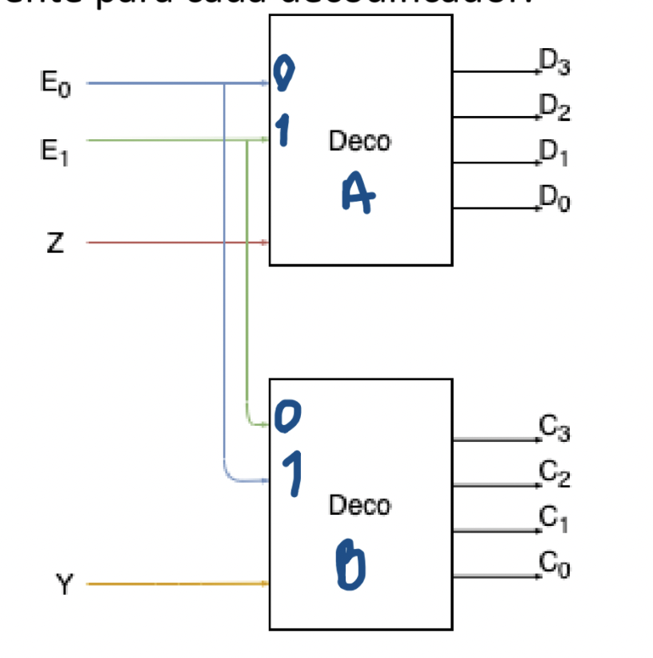

# Práctica 13

Los elementos de la práctica relevantes a este repositorio son:

- 2) Implementar una arquitectura dada gráficamente mediante decodificadores en VHDL, usando un nivel de descripción diferente para cada decodificador.
- 3) Realizar una simulación del programa del inciso 2 con los casos en la tabla de verdad siguiente.
- 4) Implementar en VHDL un decodificador 3x8 mediante decodificadores 2x4 con señal de habilitación usando los niveles de descripción que no se usaron en el inciso anterior.

## Diagrama Inciso 2

Para el inciso 2, esta es la imágen del circuito esperado:

## Tabla de Verdad Inciso 3

Para el inciso 3, se debe realizar la verificación utilizando la siguiente tabla de verdad:

|D3|D2|D1|D0|C3|C2|C1|C0|
|:---:|:---:|:---:|:---:|:---:|:---:|:---:|:---:|
|0|0|1|0|0|1|0|0|
|1|0|0|0|0|0|0|0|
|0|0|0|0|0|0|0|0|
|0|0|0|1|0|0|0|1|
|0|0|0|0|1|0|0|0|

